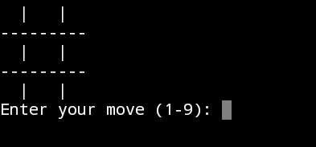

# Tic Tac Toe Game with AI

A Python implementation of the classic Tic Tac Toe game with AI opponents of varying levels.



## Table of Contents
- [Introduction](#introduction)
- [Features](#features)
- [Installation](#installation)
- [Usage](#usage)
- [Game Levels](#game-levels)
- [Contributing](#contributing)
- [License](#license)

## Introduction

This project is a command-line-based implementation of the popular Tic Tac Toe game. You can play against an AI opponent at different difficulty levels, including Easy, Medium, and Hard. The AI opponent uses the minimax algorithm with alpha-beta pruning for the "Hard" level.

## Features

- Classic Tic Tac Toe gameplay.
- Play against an AI at different difficulty levels.
- Clear display of the game board.
- Win and tie detection.
- Option to restart the game.

## Installation

1. Clone the repository to your local machine using Git:
   ```sh
   git clone https://github.com/TiyoNotFound/Tic-Tac-Toe-Python.git
   ```

2. Navigate to the project directory:
   ```sh
   cd TicTacToe-AI
   ```

3. Run the game:
   ```sh
   python tic_tac_toe.py
   ```

## Usage

- Run the game and make your moves by entering a position (1-9).
- Choose the AI level (1: Easy, 2: Medium, 3: Hard) to play against.
- Enjoy playing Tic Tac Toe!

## Game Levels

1. **Easy:** The AI makes random moves.
2. **Medium:** The AI uses a basic minimax algorithm with limited depth.
3. **Hard:** The AI employs the minimax algorithm with increased depth and heuristics for a challenging game.

## Contributing

Contributions are welcome! If you'd like to contribute to this project, please follow these guidelines:
- Fork the repository.
- Create a new branch for your feature or bug fix.
- Make your changes.
- Create a pull request.

## License

This project is licensed under the MIT License - see the [LICENSE](LICENSE) file for details.
